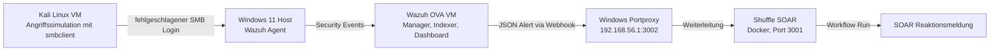

# Wazuh SIEM & Shuffle SOAR Angriffssimulation

**Projekt von:** Firas Massoussi  
**Thema:** Erkennung eines simulierten Login-Fehlers mit Wazuh und Weiterleitung an Shuffle SOAR  
**Status:** Laborprojekt / Proof of Concept

## Kurzbeschreibung

Dieses Repository dokumentiert ein lokales Cyber-Security-Lab, in dem ein simulierter Netzwerk-Login-Fehler von Kali Linux gegen einen Windows-11-Host erzeugt wurde. Der Windows-Host wurde mit einem Wazuh-Agent ueberwacht. Wazuh erkannte den Vorfall als Alert **"Logon Failure - Unknown user or bad password"** und leitete ihn ueber eine Webhook-Integration an **Shuffle SOAR** weiter. Shuffle startete daraufhin automatisch einen Workflow-Run und erzeugte eine kontrollierte Reaktionsmeldung.

Das Projekt zeigt damit eine vollstaendige SIEM-SOAR-Kette:

```text
Angriffssimulation -> Windows Event -> Wazuh Agent -> Wazuh Manager -> Alert -> Webhook -> Shuffle SOAR -> Reaktionsmeldung
```

## Architektur



## Nachgewiesene Ergebnisse

- Windows-Agent **Obito-Win11** wurde nach Anpassung der Manager-Adresse aktiv mit Wazuh verbunden.
- Kali Linux erzeugte wiederholte fehlgeschlagene SMB-Loginversuche gegen den Windows-Host.
- Wazuh erkannte die Ereignisse als Login-Fehler-Alerts.
- Wazuh sendete Alerts im JSON-Format an einen Shuffle Webhook.
- Shuffle fuehrte automatisch einen Workflow-Run aus und erzeugte eine Reaktionsmeldung.

## Repository-Struktur

```text
.
├── README.md
├── docs/
│   ├── 01_Projektbericht.md
│   ├── 02_Lab_Setup.md
│   ├── 03_Angriffssimulation.md
│   ├── 04_SOAR_Integration.md
│   ├── 05_Troubleshooting.md
│   └── 06_Employer_Summary.md
├── configs/
│   └── wazuh_shuffle_integration_sanitized.xml
├── scripts/
│   ├── simulate_smb_logon_failure.sh
│   ├── wazuh_manager_checks.sh
│   └── windows_agent_checks.ps1
├── evidence/
│   └── videos/VIDEO_MANIFEST.md
└── NOTICE.md
```

## Rechtlicher Hinweis

Die Angriffssimulation ist ausschliesslich fuer eine eigene, isolierte Laborumgebung gedacht. Die gezeigten Befehle duerfen nicht gegen fremde Systeme, fremde IP-Adressen oder produktive Umgebungen ohne ausdrueckliche Freigabe eingesetzt werden.

## Schnellstart: Simulation im Lab

Auf Kali Linux:

```bash
for i in {1..10}; do
  smbclient -L //192.168.56.1/ -U fakeuser%WrongPassword
  sleep 1
done
```

In Wazuh anschliessend unter **Threat Hunting** pruefen, ob Alerts mit der Beschreibung **Logon Failure - Unknown user or bad password** erzeugt wurden.

## Bewerbungsrelevante Skills

Dieses Projekt demonstriert praktische Kenntnisse in:

- SIEM/XDR-Grundlagen mit Wazuh
- Windows Event Monitoring
- Linux/Kali-basierter Angriffssimulation im Lab
- SOAR-Automatisierung mit Shuffle
- Webhook-Integration und JSON-Alert-Weiterleitung
- Troubleshooting von Agent-, Netzwerk-, Docker- und Portproxy-Problemen
- Dokumentation und Nachweisfuehrung fuer Security-Projekte
